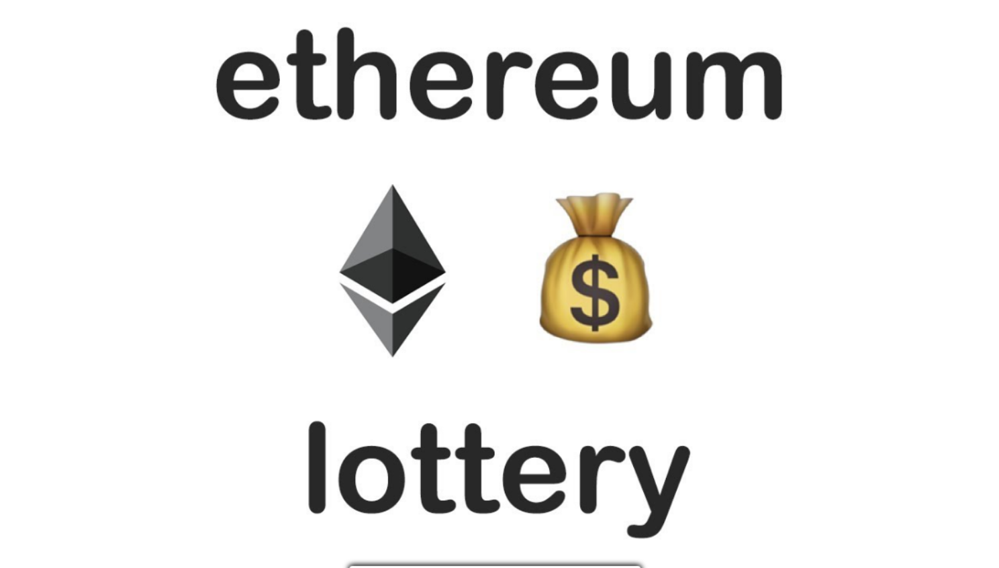
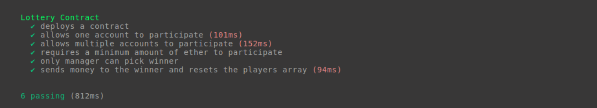
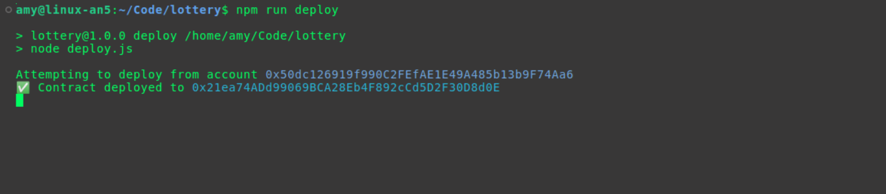
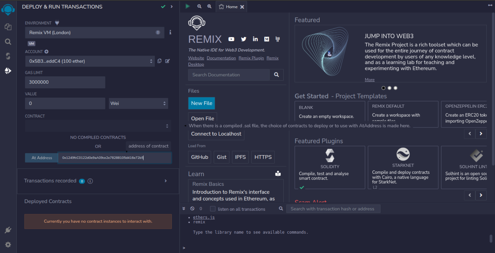
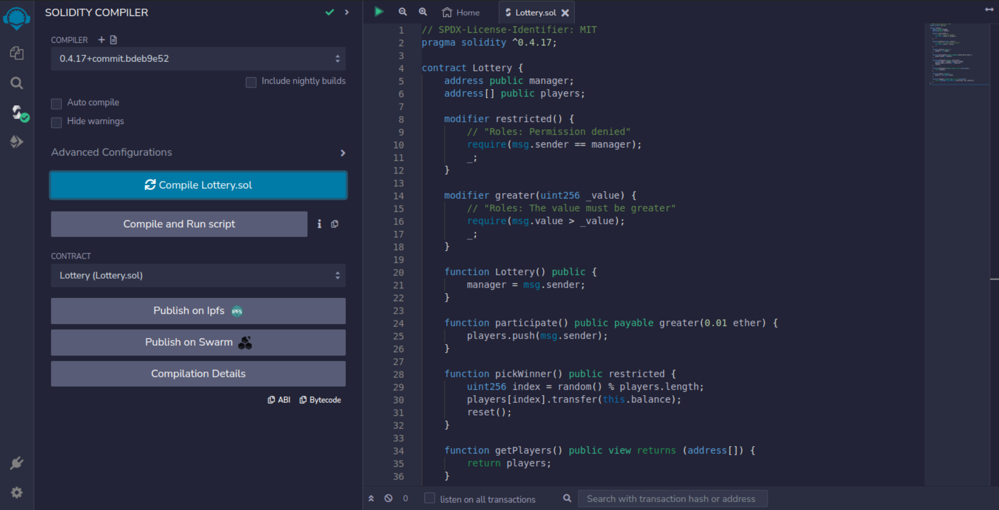
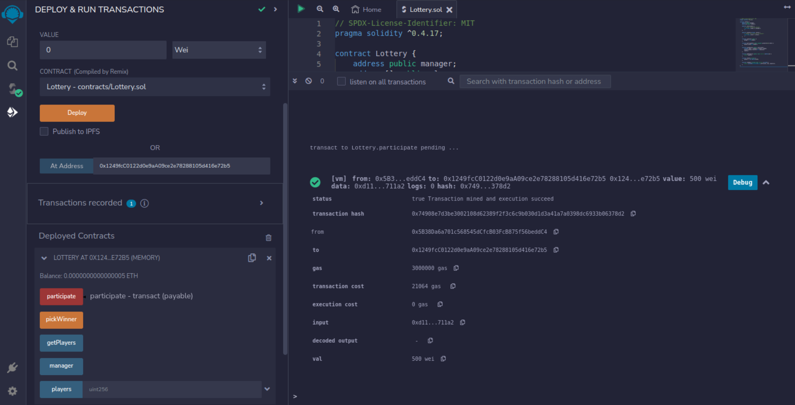
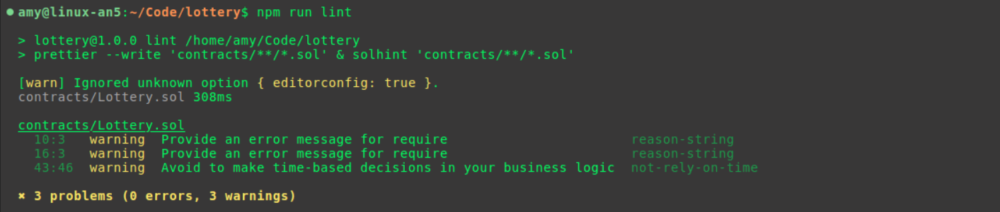

# Lottery Smart Contract



## Getting Started

1. Open project in terminal:

    ```bash
    cd project/path
    ```

2. Use specified node version:

    ```bash
    nvm use
    ```

    - The `.nvmrc` file contains the used node version.
    - You can check the node's version in `package.json` file, `"engines": { "node": "^14.20.0" }`.

3. Intall packages:

    ```bash
    npm install
    ```

4. Configure your environment variables

   1. Create env file: **`touch .env`**

   2. Add your **mnemonic** phrase (12 words).

   3. Add your provider URL.
       - **[Recommended]** use 3rd party service like [Infura](https://infura.io) -- after you create new account or login, go to endpoints tab, choose the network and protocol you want to connect, copy your personal URL, and add it to the env.
       - [Another way] setup a local node in your machine to connect the network (this way is panic).

    You have to get something like that:

    ```text
    MNEMONIC="cost spirit party essay insane festival front woman today desk pioneer wolf"
    PROVIDER_URL="https://goerli.infura.io/v3/a5aac9c4375547a8a7a34dc4dc41c279"
    ```

5. Test that everything is going well:

    ```bash
    npm run test
    ```

    

## Deployment

1. Deploy the contract on connected network (*open VPN to avoid country blocked error*)

    ```bash
    npm run deploy
    ```

   

2. Copy deployed contract address, and go to [Remix](https://remix.ethereum.org/) Web IDE

3. Open *DEPLOY & RUN TRANSACTIONS* tab

4. Past it in the second sectin at *OR* section

    

5. Copy contract source code `Lottery.sol`, and past it in new contract file in *File Explorer* tab.

    

6. Back to *DEPLOY & RUN TRANSACTIONS* tab, and click on ***At Address*** button to compile the contract and get its ABI.

7. Go to *Deployed Contracts* section, and test the App!

8. Don't forget to add **Wei** value on each payable transaction.



## Miscellaneous

### Formatting & Linting code

```bash
npm run lint
```



- It will format the code by ***Prettier***, and lint the code by ***Solhint***.

- Solhint linter's configuration placed in `package.json` > `"solhint"`

- Prettier formatter's configuration placed in `package.json` > `"prettier"`
